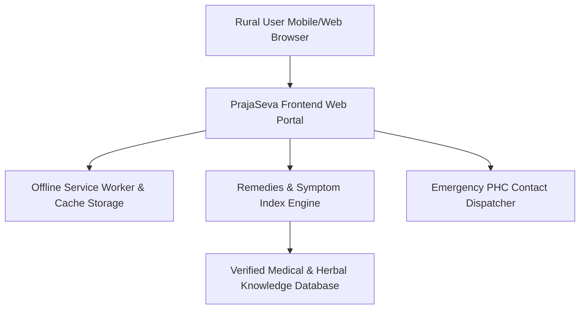

# 🏥 PrajaSeva: Rural Healthcare & Herbal Remedies Access Portal

[](https://developer.mozilla.org)
[](https://developer.mozilla.org)
[](https://developer.mozilla.org)
[](LICENSE)

**PrajaSeva** (Rural Health Remedies) is a web-based digital healthcare portal designed to bridge the accessibility gap between traditional home remedies, verified herbal knowledge, and modern healthcare resources for rural and underserved communities.

---

## 🌾 The Challenge & Solution

### The Problem
In remote and rural regions, immediate access to modern healthcare facilities, trained clinical professionals, and prescription pharmacies is severely limited. Residents frequently rely on traditional knowledge, which may lack verification or clear usage guidelines, risking adverse health outcomes.

### Our Solution
PrajaSeva provides a centralized, easy-to-use digital platform that categorizes verified traditional herbal remedies alongside clear warning indicators, recommended medical dosage guidelines, and one-click emergency contact dispatching to nearby primary health centers (PHCs).

---

## 🌟 Key Features

* **Verified Herbal Remedies Index**: Categorized index of traditional treatments for common ailments (respiratory, digestive, skin, first aid) with verified safety guidelines.
* **Symptom-Based Search**: Intuitive search interface enabling users to query symptoms and view safe home treatments vs. symptoms requiring immediate clinical care.
* **Offline Local Storage Caching**: Caches critical medical advice and emergency contact details locally on device for offline rural connectivity.
* **Emergency Health Center Dispatch**: Quick-access directory and one-touch calling for regional Primary Health Centers (PHCs) and emergency ambulance services.
* **Multilingual UI Layout**: Designed with low-bandwidth, high-contrast, accessible typography tailored for rural mobile displays.

---

## 🏗️ System Architecture



---

## 🚀 Quick Start Guide

### Setup & Local Execution
```bash
# Clone repository
git clone https://github.com/dewernodecimal/PrajaSeva.git
cd PrajaSeva

# Open in browser
# Open index.html directly in any web browser or use a simple HTTP server:
python -m http.server 8000
```
Navigate to `http://localhost:8000` to access the portal.

---

## 📄 License
Distributed under the MIT License. See `LICENSE` for details.
